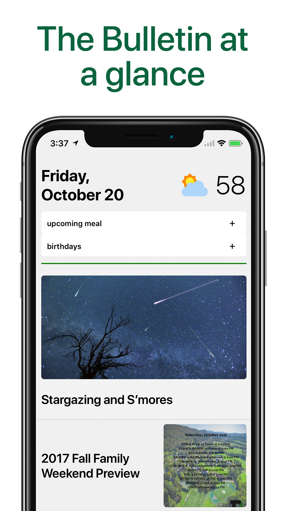
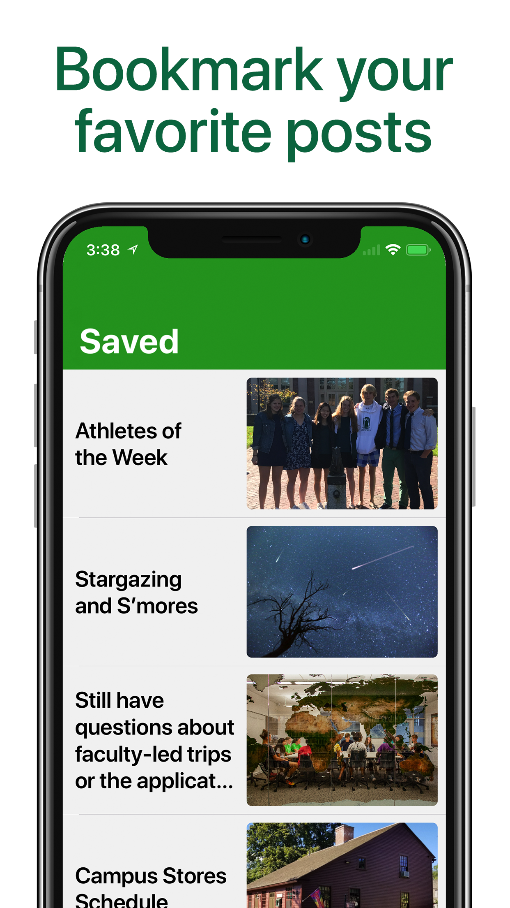
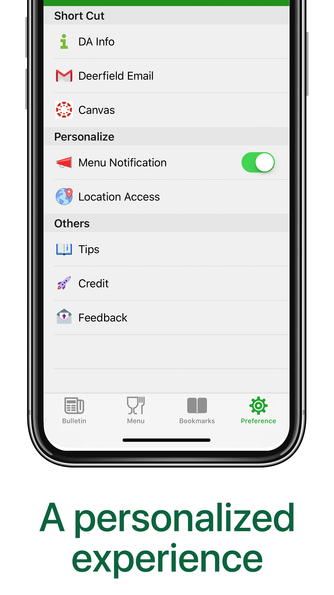
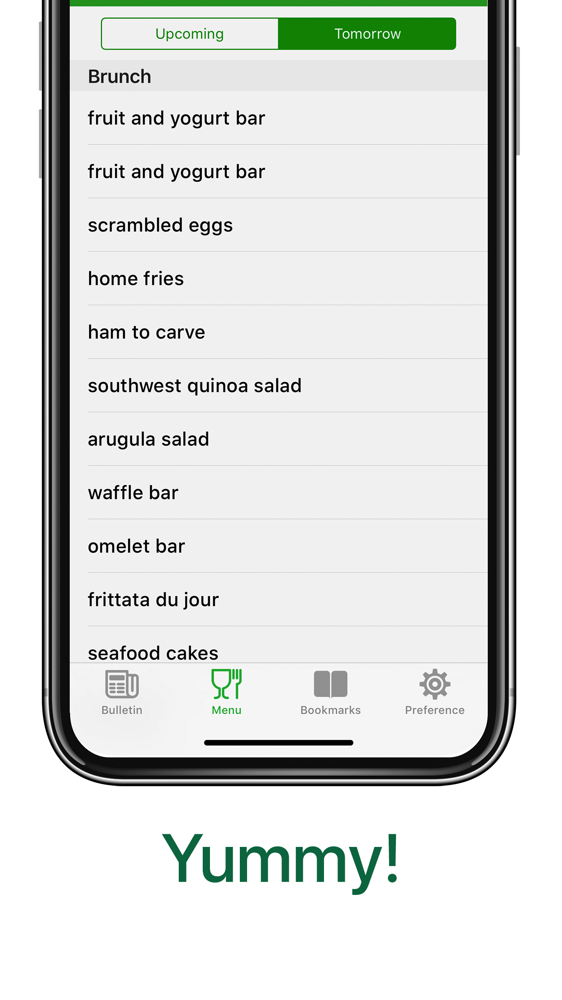
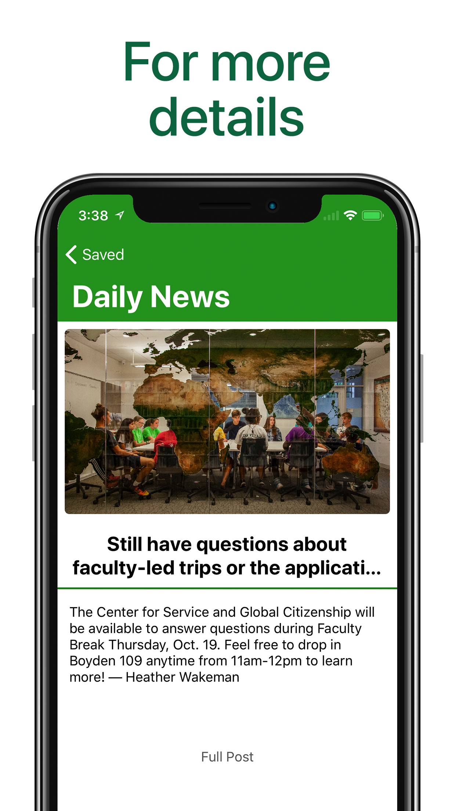
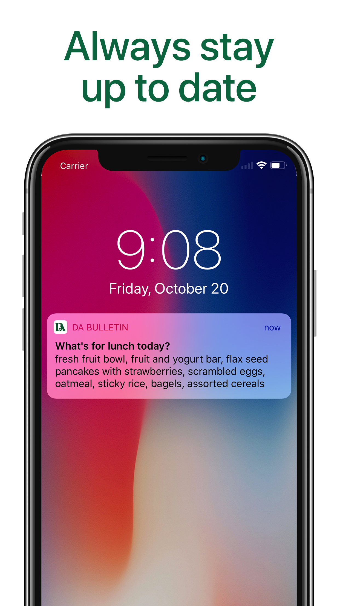

  

# DA-Mobile

DA Mobile application, made by the app development club. 

[Download](https://goo.gl/XzZzts) the App Now!

## Introduction:

The Deerfield App Development Club launched the DA Bulletin App in the Spring of 2017. The goal of the app is to bring the Deerfield bulletin to students' and faculties' mobile devices by providing a convenient and intuitive user experience. 

Now, the App is open source on Github. If you are interested in contributing to the effort, feel free to make a pull request. You can also contact us at contact@appdevelopmentclub.org

|        |           | 
| ------------- |:-------------:|
|       | 

# Features

The app will load bulletin post from the past five days. You can also check the menu for upcoming meals and birthdays on the front page. Click on a post to see the full information, swipe left on any post to save it in your bookmarks. 

### Key Features

- View bulletin articles from the past 5 days.
- View details & summaries from bulletin posts.
- Save Bulletin articles into your own unique collection.
- View the weather forecast in Deerfield.
- View the menu upcoming menu, breakfast, lunch, and dinner. Enable notifications to see what’s for lunch without having to unlock your phone!
- Access birthdays on the current day.
- Add the widget which shows upcoming meals and the weather.

|        |           | 
| ------------- |:-------------:|
|       |     
|  |  

I hope you will enjoy using DA mobile. Please don't hesitate to contact us if you have any question, comments or concerns. If you like the app, please give us a five-star rating on the [App Store](https://goo.gl/XzZzts). 

## Credit:

Thanks to the following people who contributed to the development process:

Faculty:

- Peter Nilsson
- Ben Bakker
- David Thiel

Students

- Neil Nie
- Valerie Hetherington
- Shreyas Sinha
- Max Bronckers

## Info

Our contact information:

Development Team: contact@appdevelopmentclub.org

Leadership Team: ynie19@deerfield.edu
